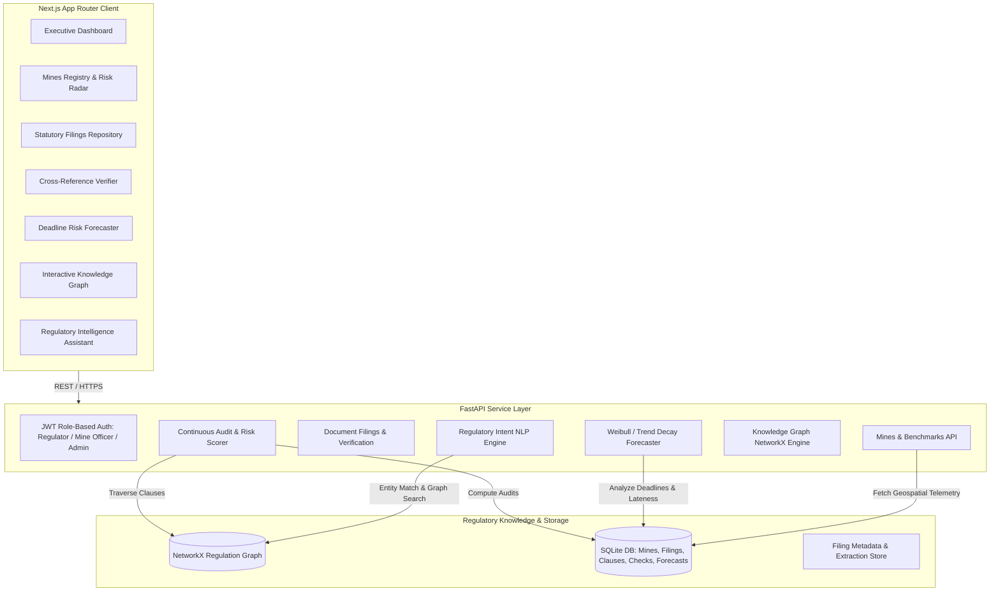

# 🛡️ Aegis-Compliance: Autonomous Regulatory Intelligence for Indian Coal Mines

[](https://github.com/beingaditya18/Fault-Tolerance)
[](https://github.com/beingaditya18/Fault-Tolerance)
[](https://opensource.org/licenses/MIT)
[](https://fastapi.tiangolo.com)
[](https://nextjs.org)

**Aegis-Compliance** is an enterprise-grade statutory compliance verification and predictive risk forecasting platform built specifically for the **Indian Coal Mining Industry**.

India operates hundreds of opencast and underground coal mines across public (Coal India subsidiaries: CCL, BCCL, SECL, MCL, ECL, NCL, WCL) and private operators. Each mine is bound by a complex web of statutory frameworks:
* **The Mines Act 1952**
* **Coal Mines Regulations 2017 (CMR 2017)**
* **DGMS (Directorate General of Mines Safety) Technical Circulars**
* **MoEF&CC Environmental Clearance (EC) Conditions**
* **State Pollution Control Board (CPCB / SPCB) Standards & Water/Air Acts**
* **Mines Rules 1955 & Labor Welfare Mandates**

Aegis-Compliance replaces manual, paper-heavy, and reactive regulatory audits with **continuous automated ingestion, cross-referencing, predictive risk modeling, and knowledge graph tracing**.

---

## 🏗️ System Architecture



---

## ✨ Key Capabilities

1. **Executive Compliance Dashboard**
   - Real-time statutory compliance metrics across all registered coal mines in India.
   - Live breakdown of high-risk vs compliant mines, pending submissions, and open violations.
   - Visual category distribution (Safety, Environmental, Labor, DGMS).

2. **Continuous Regulatory Cross-Referencing**
   - Ingests statutory filings (Safety Management Plans, EC Compliance Returns, Form IV Accident Registers, Air Quality Audits, Medical Examination Records).
   - Automatically cross-references submitted evidence against statutory clauses (e.g. *CMR 2017 Reg. 17, Mines Act 1952 Sec. 23*).
   - Flags missing mandatory declarations, lapsed certifications, and non-compliant readings.

3. **Predictive Deadline & Risk Forecaster**
   - Computes overdue probability and penalty escalation risks using historical submission cadences and historical violation frequency.
   - Provides proactive risk alerts before statutory deadlines lapse.

4. **Interactive Regulatory Knowledge Graph**
   - Visualizes statutory relationships across **Acts**, **Specific Clauses**, **Required Filing Types**, and **Target Mines**.
   - Canvas force-directed layout with pan, zoom, node isolation, and degree-of-connection exploration.

5. **Regulatory Intelligence Assistant (Chatbot)**
   - Natural language question answering grounded in the Indian coal mining legal corpus.
   - Provides clause citations, confidence scores, and direct links to indexed regulations.

---

## 💻 Tech Stack

* **Frontend**: TypeScript, React 19, Next.js 16 (App Router), Tailwind CSS v4, Motion, Tabler Icons, Recharts, Canvas Graph Rendering.
* **Backend**: Python 3.11+, FastAPI, SQLite, SQLAlchemy ORM, NetworkX, PyJWT, Passlib (Bcrypt).
* **Compliance Engines**: Deterministic statutory rule engine, semantic similarity matcher, deadline decay forecaster.

---

## 🚀 Running Locally (One-Click)

On Windows, you can launch both backend and frontend simultaneously with a single click:

```bash
# Double click or run in terminal:
start.bat
```

This will automatically:
1. Detect Python & Node.js
2. Create/activate the backend Python virtual environment and install dependencies
3. Auto-seed the SQLite database (`aegis_compliance.db`)
4. Install frontend npm dependencies
5. Launch FastAPI backend on `http://127.0.0.1:8000`
6. Launch Next.js frontend on `http://localhost:3000`
7. Automatically open the portal in your default browser

---

## ☁️ Deploying on Railway

Aegis is pre-configured with `railway.json`, `Procfile`, and Dockerfiles for seamless Railway deployment.

### Step 1: Deploy the Backend on Railway
1. Go to [railway.com](https://railway.com) and create a **New Project** -> **Deploy from GitHub repo**.
2. Select the repository `aaradhya1077/Aegis`.
3. In **Settings** -> **Root Directory**, set `/backend`.
4. In **Networking**, click **Generate Domain** (e.g. `https://aegis-backend-production.up.railway.app`).
5. (Optional) In **Variables**, add:
   - `JWT_SECRET`: your custom secure secret
   - `GROQ_API_KEY`: (optional, for AI chatbot features)

### Step 2: Deploy the Frontend on Railway
1. In the same Railway project (or a new project), click **+ New** -> **GitHub Repo** -> select `aaradhya1077/Aegis`.
2. Leave Root Directory as `/` (root).
3. In **Variables**, add:
   - `NEXT_PUBLIC_API_URL`: your backend Railway domain (e.g., `https://aegis-backend-production.up.railway.app`)
4. In **Networking**, click **Generate Domain** to get your live public URL!

---

## 👥 Demo Access Credentials

| Role | Officer ID | Password | Access Scope |
|---|---|---|---|
| **DGMS Regulator** | `REG-001` | `pass123` | Full statutory oversight, penalty sanctions, nationwide cross-referencing |
| **Mine Manager** | `MINE-001` | `pass123` | Subsidiary mine filings, internal audit readiness, corrective action plans |
| **Frontline Sirdar** | `FIELD-001` | `pass123` | Pre-shift gas audits, strata crack logs, berm checks & offline PWA |
| **System Administrator** | `ADMIN-001` | `admin123` | System telemetry, knowledge graph re-indexing, user role management |

---

## 📜 Regulatory Sources Indexed
* *The Mines Act, 1952 (Act No. 35 of 1952)*
* *Coal Mines Regulations, 2017 (CMR 2017 - G.S.R. 1466(E))*
* *Directorate General of Mines Safety (DGMS) Technical & Safety Circulars*
* *Ministry of Environment, Forest and Climate Change (MoEF&CC) Environmental Clearance Norms*
* *The Mines Rules, 1955 & Mineral Conservation and Development Rules*

---

## 📄 License
Distributed under the MIT License. See `LICENSE` for more information.
